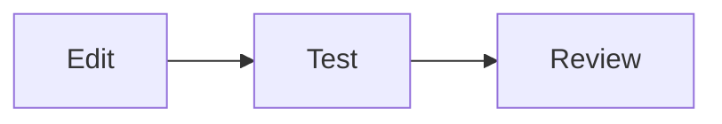

# DuskMoon UI for Flutter

[](https://github.com/duskmoon-dev/flutter-duskmoon-ui/actions/workflows/ci.yml)
[](https://github.com/duskmoon-dev/flutter-duskmoon-ui/actions/workflows/deploy-pages.yml)

DuskMoon UI is a Flutter design system with generated themes, Material/Cupertino/Fluent adaptive widgets, Markdown and chat components, native Mermaid diagrams, forms, data visualization, and a code editor. The project is a Dart native workspace managed with Melos 8.

[Live demo](https://duskmoon-dev.github.io/flutter-duskmoon-ui/) · [pub.dev](https://pub.dev/packages/duskmoon_ui) · [API documentation](https://pub.dev/documentation/duskmoon_ui/latest/)

## Installation

Install the umbrella package for the primary DuskMoon APIs:

```bash
flutter pub add duskmoon_ui
```

Packages can also be installed individually to keep dependencies focused:

```bash
flutter pub add duskmoon_theme
flutter pub add duskmoon_widgets
flutter pub add duskmoon_mermaid_renderer
```

Requires Dart >=3.5.0 and Flutter >=3.24.0.

## Quick Start

```dart
import 'package:duskmoon_ui/duskmoon_ui.dart';
import 'package:flutter/material.dart';

void main() => runApp(const DemoApp());

class DemoApp extends StatelessWidget {
  const DemoApp({super.key});

  @override
  Widget build(BuildContext context) {
    return MaterialApp(
      theme: DmThemeData.sunshine(),
      darkTheme: DmThemeData.moonlight(),
      home: const HomePage(),
    );
  }
}

class HomePage extends StatelessWidget {
  const HomePage({super.key});

  @override
  Widget build(BuildContext context) {
    return Scaffold(
      appBar: const DmAppBar(title: Text('DuskMoon')),
      body: Center(
        child: DmButton(
          onPressed: () => showDmSuccessToast(
            context: context,
            message: 'Hello DuskMoon!',
          ),
          child: const Text('Tap me'),
        ),
      ),
    );
  }
}
```

## Packages

| Package | Purpose | pub.dev |
| --- | --- | --- |
| [`duskmoon_ui`](packages/duskmoon_ui/) | Umbrella export for themes, widgets, settings, feedback, forms, visualization, theme BLoC, and code-editor APIs | [Version](https://pub.dev/packages/duskmoon_ui) |
| [`duskmoon_theme`](packages/duskmoon_theme/) | Generated color schemes, semantic colors, typography, and complete `ThemeData` factories | [Version](https://pub.dev/packages/duskmoon_theme) |
| [`duskmoon_theme_bloc`](packages/duskmoon_theme_bloc/) | BLoC-backed theme name and mode persistence | [Version](https://pub.dev/packages/duskmoon_theme_bloc) |
| [`duskmoon_widgets`](packages/duskmoon_widgets/) | Material, Cupertino, and Fluent widgets plus Markdown, chat, and code-editor components | [Version](https://pub.dev/packages/duskmoon_widgets) |
| [`duskmoon_settings`](packages/duskmoon_settings/) | Cross-platform settings lists, sections, and tiles | [Version](https://pub.dev/packages/duskmoon_settings) |
| [`duskmoon_feedback`](packages/duskmoon_feedback/) | Adaptive dialogs, snackbars, toasts, and bottom sheets | [Version](https://pub.dev/packages/duskmoon_feedback) |
| [`duskmoon_form`](packages/duskmoon_form/) | BLoC-based form state and adaptive field builders | [Version](https://pub.dev/packages/duskmoon_form) |
| [`duskmoon_visualization`](packages/duskmoon_visualization/) | Themed line, bar, scatter, heatmap, network, and other chart widgets | [Version](https://pub.dev/packages/duskmoon_visualization) |
| [`duskmoon_code_engine`](packages/duskmoon_code_engine/) | CodeMirror-inspired editor engine with 19 grammar modules | [Version](https://pub.dev/packages/duskmoon_code_engine) |
| [`duskmoon_adaptive_scaffold`](packages/duskmoon_adaptive_scaffold/) | Responsive Material 3 scaffold and composable slot layouts | [Version](https://pub.dev/packages/duskmoon_adaptive_scaffold) |
| [`duskmoon_mermaid_renderer`](packages/duskmoon_mermaid_renderer/) | Native Flutter Canvas renderer for 30 Mermaid diagram families | [Version](https://pub.dev/packages/duskmoon_mermaid_renderer) |

## Themes and Adaptive Rendering

`DmThemeData` provides Sunshine and Forest light themes plus Moonlight and Ocean dark themes. Each includes the matching `DmColorExtension` semantic tokens. Colors come from generated design tokens rather than runtime seed generation.

Adaptive components select Material, Cupertino, or Fluent rendering. Resolution follows the per-widget `platformOverride`, the nearest `DmPlatformOverride`, an app-level `DuskmoonApp`, and finally `Theme.of(context).platform`.

```dart
DmButton(
  platformOverride: DmPlatformStyle.fluent,
  onPressed: () {},
  child: const Text('Always Fluent'),
);
```

## Markdown and Mermaid

`DmMarkdown` supports GFM, KaTeX, syntax highlighting, CSS color chips, YAML front matter, custom builders, and incremental streaming. Mermaid code blocks are opt-in and render without JavaScript, SVG, or a WebView.

````dart
DmMarkdown(
  data: '''
# Build flow


''',
  config: const DmMarkdownConfig(enableMermaid: true),
);
````

Use `DmMermaidView` directly when the source is already a Mermaid diagram.

## Code Editor

The standalone editor uses immutable state, a rope document model, incremental parsing, virtualized lines, and 19 grammar modules covering 21 named languages.

```dart
CodeEditorWidget(
  initialDoc: 'void main() => print("Hello");',
  language: dartLanguageSupport(),
  theme: EditorTheme.dark(),
);
```

## Development

On Nix systems, enter `devenv shell` first to use the configured Flutter SDK.

```bash
dart pub get
melos run format
melos run analyze
melos run test
```

Run the showcase locally:

```bash
cd example
flutter run -d chrome
```

`melos run codegen` regenerates theme tokens and requires `duskmoon-codegen` plus the sibling `../duskmoon-dev-design/tokens` directory. For contribution conventions and focused package commands, see [AGENTS.md](AGENTS.md).

## License

MIT
